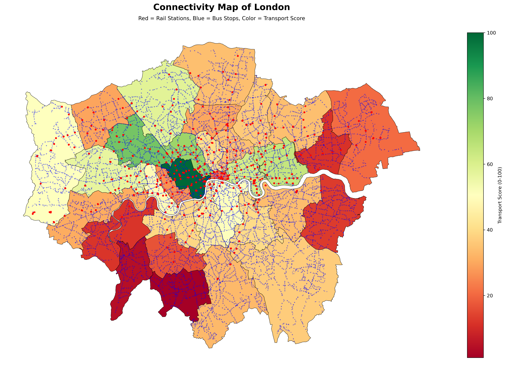
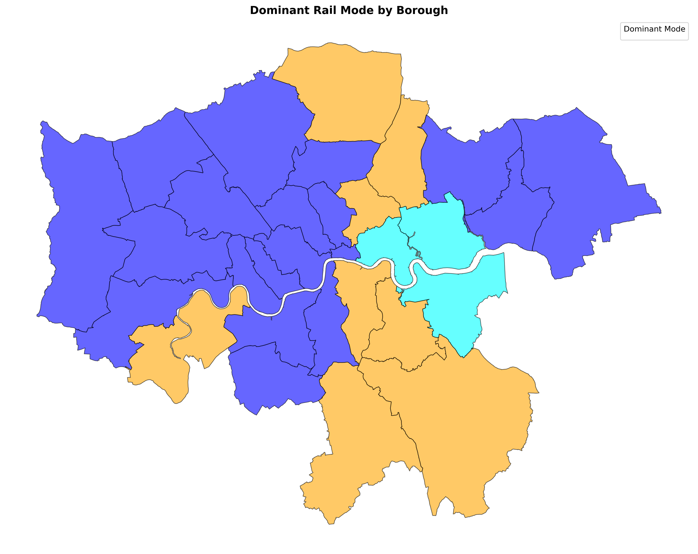
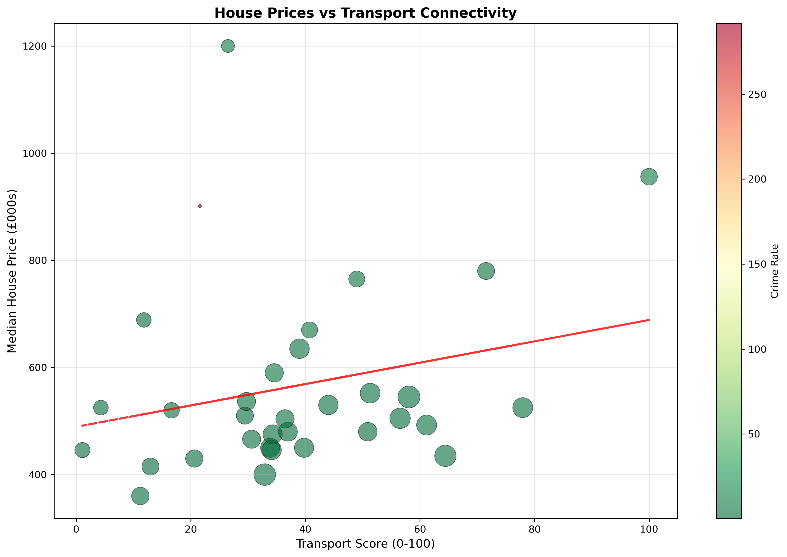

# The London Index
A multi-source analysis of London data, aggregated into a composite liveability index

## 🎯 Project Aim

This project analyzes quality of life and housing affordability across London's 33 boroughs to identify which areas offer the best trade-offs between livability and cost. By combining transport accessibility, crime rates, economic indicators, and property prices, we answer: **"Which London boroughs provide the best value for residents?"**

---

## 📊 Data Sources

| Source | Data Collected | Access Method |
|--------|---------------|---------------|
| **Transport for London (TfL) API** | 917 rail stations, 648 bus routes with 19,813 unique stops | REST API |
| **Police.uk API** | 30,774 crime incidents (October 2024) across 14 categories | REST API |
| **UK Land Registry** | 913,320 property transactions (2024), filtered to 103,714 London sales | CSV Download |
| **London Datastore** | Borough boundaries (GIS), population, earnings (Dec 2024), jobs density (Dec 2023) | CSV/GeoJSON/Excel |

---

## 🔧 Collection & Preprocessing

**Data Collection:**
- Automated API calls for real-time transport and crime data (95.7% bus route coverage)
- Bulk downloads for property prices and economic indicators
- Spatial matching of 917 stations and 19,813 bus stops to borough boundaries

**Data Cleaning:**
- Deduplicated 2,646 → 957 unique TfL stations (removed platform duplicates)
- Removed 62,998 directional bus stop duplicates (northbound/southbound variants)
- Spatially matched transport infrastructure to 33 boroughs using geopandas
- Filtered 913k UK properties → 104k London transactions using county labels
- Parsed multi-sheet Excel files to extract 2024 earnings and 2023 jobs density

**Feature Engineering:**
- Created composite transport score (60% rail + 40% bus coverage, normalized 0-100)
- Calculated crime rate per 1,000 residents for fair comparison
- Identified dominant transport mode (tube/overground/DLR) per borough
- Aggregated all metrics to borough level (33 boroughs × 18 indicators)

**Final Output:** 
Clean dataset ready for analysis and modeling.

---

## 🗺️ Key Visualizations

### London Transport Infrastructure Map

*Red dots = 917 rail stations | Blue dots = 19,813 bus stops | Background color = Transport accessibility score (0-100)*

**Spatial patterns revealed:**
- Rail concentrated in central/northern London (Westminster: 75 stations)
- Bus coverage universal across all 33 boroughs
- 3 boroughs lack rail entirely: Bexley, Kingston upon Thames, Sutton
- Clear north-south divide in rail accessibility

---

### Dominant Rail Mode by Borough

**Geographic division of transport modes:**
- **West/Central London:** Tube-dominated (Westminster, Camden, Ealing)
- **East London:** DLR corridor (Newham: 41 DLR stations, Tower Hamlets: 35)
- **Scattered:** Overground connections (Brent, Hackney, Southwark)
- **Elizabeth Line:** West-East axis (Hillingdon → Ealing → Newham)

---

### House Prices vs Transport Connectivity

**Economic relationships:**
- Moderate positive correlation (r = 0.379) between transport score and house prices
- Price range: £360k (Barking & Dagenham) to £1.2M (Kensington & Chelsea)
- Transport score range: 1.08 (Sutton) to 100.00 (Westminster)
- Bubble size represents population, color indicates crime rate

---

## 🔍 Key Connectivity Findings

### Coverage Patterns
- **95.7% bus route coverage** (648 of 677 London bus routes collected)
- **Rail inequality:** Top 5 boroughs contain 63.4% of all rail stations
- **Bus equity:** More evenly distributed (all boroughs have 21-57 routes)
- **Population impact:** 1.58M Londoners (14.1%) live in poorly connected areas (transport score <20)

### Transport Equity Analysis
- **No income penalty for bus-only boroughs:** £20.15/hr vs £20.41/hr (rail-served)
- **Cumulative advantage pattern:** Boroughs with more rail ALSO have more buses (r = 0.549)
- **Surprising finding:** Bus-only outer suburbs (Kingston, Bexley, Sutton) earn similar incomes to rail-served areas
- **Modal inequality:** Wealthier central boroughs have tube access; outer/eastern areas rely on overground/DLR

### Mode Distribution
- **Tube:** 542 stations (59.1%) - concentrated in central/western London
- **Overground:** 255 stations (27.8%) - distributed across outer boroughs
- **DLR:** 99 stations (10.8%) - East London corridor
- **Elizabeth Line:** 60 stations (6.5%) - recent addition creating west-east connectivity axis

### Geographic Patterns
- **East London:** DLR-heavy (Newham, Tower Hamlets, Greenwich)
- **West/Central:** Tube-dominated (Westminster with 71 tube stations)
- **Outer South:** Bus-dependent (3 boroughs with zero rail stations)
- **Bus coverage:** Relatively uniform (21-57 routes per borough) despite rail disparities

---

